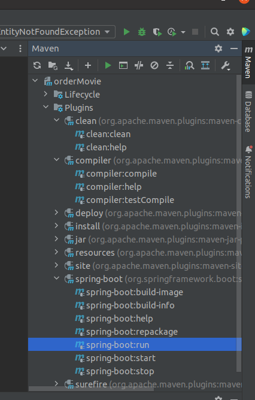

# GUIDE for Test Project

## Installation

pull this repo from git by command: clone

```bash
clone
```
## Run the project:
if you haven't installed maven yet, before running next command, if maven installed please skip this command.
```bash
sudo apt install maven
```
by command terminal:
```bash
mvn spring-boot:run
```
or you can use UI of IDE(ex: **intellij**)



## Access to H2 Database

```python
spring.datasource.username = admin
spring.datasource.password = admin
```
So you can access to DB by: [h2-console](http://localhost:8080/h2-console/login.jsp), depends on which port do you use for running the application, default set up port: 8080.
Or you can use UI of IDE with settings:

```python
Path: ./data/orderMovie.mv.db
URL: jdbc:h2:file:./data/orderMovie
User: admin
Password: admin
```

<font color="red">
Before running the application don't forget close session(open connection) with database because in this case we use database connection with file:  
</font>

```python
jdbc:h2:file:./data/orderMovie
```
So if you won't close the session it throws: "Database may be already in use" exception

Database stored in folder: ./data

## Run Unit Test
```python
mvn test
```

## Interface for calling endpoints

[Swagger](http://localhost:8080/swagger-ui/index.html)